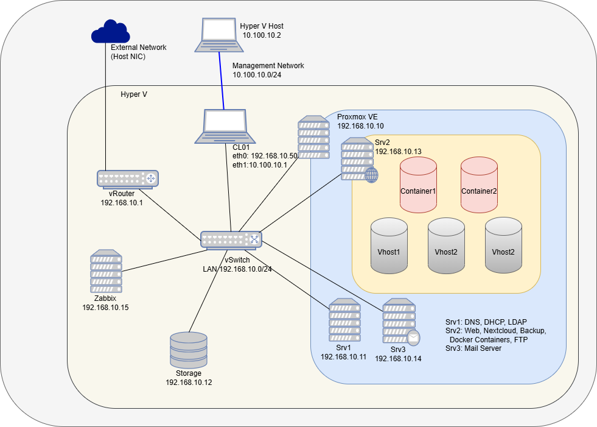

# Linux Server Infrastructure Lab with Nested Virtualization

## Overview

This project documents a virtualized Linux server environment built with nested virtualization.  
The lab simulates a small IT infrastructure where multiple Linux servers provide common network and application services.

The environment is designed to practice system administration, networking, and service deployment in a realistic infrastructure scenario.

Key technologies include:

- Linux server administration
- Network services (DNS, DHCP, LDAP)
- Web and collaboration services
- Containerized applications
- Monitoring and backup
- Nested virtualization using Proxmox

---

## Architecture Overview

The lab environment runs on a physical host using Hyper-V.  
Inside the virtual environment, Proxmox VE provides nested virtualization to host multiple Linux servers and infrastructure services.

---

## Network Design

The environment contains two main networks:

- **LAN Network** – internal communication between servers  
- **Management Network** – administrative access via jump host (CL01)  

The management network allows SSH access to all servers through the jump host.

---

## Components / Infrastructure

| Component | Description | IP Address |
|-----------|------------|------------|
| Router | Provides routing between internal and external networks | 192.168.10.1 |
| CL01 – Jump Host | Admin access to internal servers | 192.168.10.50 |
| Srv1 | DNS, DHCP, LDAP | 192.168.10.11 |
| Srv2 | Web Server, Nextcloud, Docker containers, FTP, Backup | 192.168.10.13 |
| Srv3 | Mail Server | 192.168.10.14 |
| Zabbix | Monitoring system | 192.168.10.15 |
| Storage | Shared storage for services and backups | 192.168.10.12 |
| Proxmox VE | Nested virtualization platform | 192.168.10.10 |

---

## Server Roles & Services

| Server | Roles / Services |
|--------|-----------------|
| **Srv1** | DNS, DHCP, LDAP |
| **Srv2** | Web Server, Nextcloud, Docker container environment, FTP, Backup |
| **Srv3** | Mail Server |
| **CL01** | Jump Host for administrative access |
| **Zabbix** | Monitoring system for servers and services |
| **Storage** | Provides storage for services and backups |
| **Router** | Routing between internal and external networks |
| **Proxmox VE** | Nested virtualization platform hosting additional Linux servers |

---

## Purpose of the Project

This lab environment was created to:

- Practice Linux system administration  
- Deploy and configure typical enterprise services  
- Understand network architecture and service dependencies  
- Experiment with virtualization and containerization  
- Simulate a small enterprise IT infrastructure

---

## Technologies Used

- Linux  
- Proxmox VE  
- Hyper-V  
- Docker  
- Zabbix  
- Nextcloud  
- DNS / DHCP  
- LDAP  
- Mail Server  
- SSH
- Ftp
